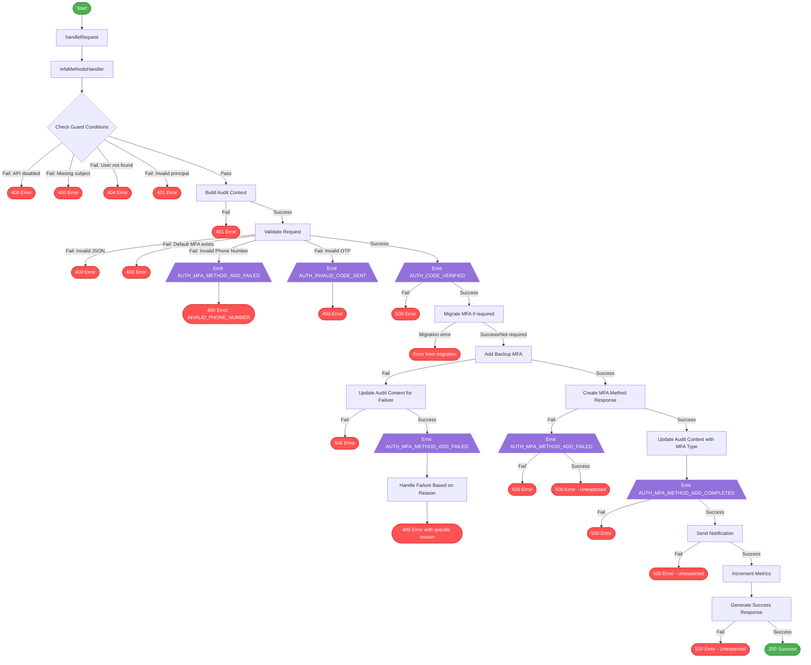

# MFA Method Creation Flow

This diagram illustrates the flow of the `MFAMethodsCreateHandler` class, showing the different paths through the code and which audit events are emitted along each path.

## Audit Events by User Journey

### Successful MFA Method Creation

#### Non-Migrated User Adds SMS Method
- **AUTH_CODE_VERIFIED**: Emitted after successful OTP validation
  - Includes metadata: MFA_CODE_ENTERED, NOTIFICATION_TYPE=MFA_SMS, ACCOUNT_RECOVERY=false, JOURNEY_TYPE=ACCOUNT_MANAGEMENT
  - Includes metadata: MFA_METHOD=backup, MFA_TYPE=SMS
- **AUTH_MFA_METHOD_MIGRATION_ATTEMPTED**: Emitted during MFA method migration
  - Includes metadata: JOURNEY_TYPE=ACCOUNT_MANAGEMENT
- **AUTH_MFA_METHOD_ADD_COMPLETED**: Emitted after MFA method is successfully added
  - Includes metadata: MFA_TYPE=SMS, JOURNEY_TYPE=ACCOUNT_MANAGEMENT
  - Includes phone number in audit context

#### Migrated User Adds SMS Method
- **AUTH_CODE_VERIFIED**: Emitted after successful OTP validation
  - Includes metadata: MFA_CODE_ENTERED, NOTIFICATION_TYPE=MFA_SMS, ACCOUNT_RECOVERY=false, JOURNEY_TYPE=ACCOUNT_MANAGEMENT
  - Includes metadata: MFA_METHOD=backup, MFA_TYPE=SMS
- **AUTH_MFA_METHOD_ADD_COMPLETED**: Emitted after MFA method is successfully added
  - Includes metadata: MFA_TYPE=SMS, JOURNEY_TYPE=ACCOUNT_MANAGEMENT

#### Non-Migrated User Adds Auth App Method
- **AUTH_CODE_VERIFIED**: Emitted after successful validation
  - Includes metadata: ACCOUNT_RECOVERY=false, JOURNEY_TYPE=ACCOUNT_MANAGEMENT
  - Includes metadata: MFA_METHOD=backup, MFA_TYPE=AUTH_APP
- **AUTH_MFA_METHOD_MIGRATION_ATTEMPTED**: Emitted during MFA method migration
  - Includes metadata: JOURNEY_TYPE=ACCOUNT_MANAGEMENT
- **AUTH_MFA_METHOD_ADD_COMPLETED**: Emitted after MFA method is successfully added
  - Includes metadata: MFA_TYPE=AUTH_APP, JOURNEY_TYPE=ACCOUNT_MANAGEMENT

#### Migrated User Adds Auth App Method
- **AUTH_CODE_VERIFIED**: Emitted after successful validation
  - Includes metadata: ACCOUNT_RECOVERY=false, JOURNEY_TYPE=ACCOUNT_MANAGEMENT
  - Includes metadata: MFA_METHOD=backup, MFA_TYPE=AUTH_APP
- **AUTH_MFA_METHOD_ADD_COMPLETED**: Emitted after MFA method is successfully added
  - Includes metadata: MFA_TYPE=AUTH_APP, JOURNEY_TYPE=ACCOUNT_MANAGEMENT

### Failed Journeys

#### Invalid Phone Number (SMS Method Only)
- **AUTH_MFA_METHOD_ADD_FAILED**: Emitted when an invalid phone number is provided
  - Includes metadata: MFA_METHOD=default, JOURNEY_TYPE=ACCOUNT_MANAGEMENT
  - Includes metadata: MFA_TYPE=(from default method)

#### Invalid OTP (SMS Method Only)
- **AUTH_INVALID_CODE_SENT**: Emitted when an invalid OTP code is provided
  - Includes metadata: MFA_METHOD=backup, JOURNEY_TYPE=ACCOUNT_MANAGEMENT

#### Auth App Already Exists (Migrated User)
- **AUTH_CODE_VERIFIED**: Emitted after successful validation
  - Includes metadata: ACCOUNT_RECOVERY=false, JOURNEY_TYPE=ACCOUNT_MANAGEMENT
  - Includes metadata: MFA_METHOD=backup, MFA_TYPE=AUTH_APP
- **AUTH_MFA_METHOD_ADD_FAILED**: Emitted when adding backup Auth App method fails
  - Includes metadata: MFA_TYPE=AUTH_APP, MFA_METHOD=default, JOURNEY_TYPE=ACCOUNT_MANAGEMENT

#### Auth App Already Exists (Non-Migrated User)
- **AUTH_CODE_VERIFIED**: Emitted after successful validation
  - Includes metadata: ACCOUNT_RECOVERY=false, JOURNEY_TYPE=ACCOUNT_MANAGEMENT
  - Includes metadata: MFA_METHOD=backup, MFA_TYPE=AUTH_APP
- **AUTH_MFA_METHOD_MIGRATION_ATTEMPTED**: Emitted during MFA method migration
  - Includes metadata: JOURNEY_TYPE=ACCOUNT_MANAGEMENT
- **AUTH_MFA_METHOD_ADD_FAILED**: Emitted when adding backup Auth App method fails
  - Includes metadata: MFA_TYPE=AUTH_APP, MFA_METHOD=default, JOURNEY_TYPE=ACCOUNT_MANAGEMENT