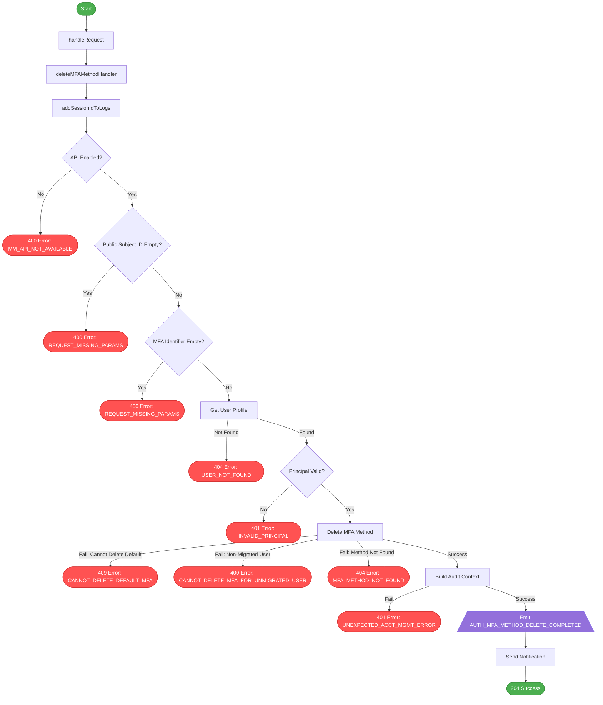

# MFA Method Delete Flow

This diagram illustrates the flow of the `MFAMethodsDeleteHandler` class, showing the different paths through the code and which audit events are emitted along each path.

## Audit Events by User Journey

### Successful Journeys

#### Deleting SMS Backup Method
- **AUTH_MFA_METHOD_DELETE_COMPLETED**: Emitted after successful deletion of SMS backup method
  - Includes metadata: JOURNEY_TYPE=ACCOUNT_MANAGEMENT
  - Includes metadata: MFA_TYPE=SMS
  - Includes metadata: PHONE_NUMBER_COUNTRY_CODE=44
  - Includes phone number in audit context

#### Deleting Auth App Backup Method
- **AUTH_MFA_METHOD_DELETE_COMPLETED**: Emitted after successful deletion of Auth App backup method
  - Includes metadata: JOURNEY_TYPE=ACCOUNT_MANAGEMENT
  - Includes metadata: MFA_TYPE=AUTH_APP

### Failed Journeys

#### API Disabled
- No audit events are emitted when the API is disabled

#### Missing Parameters
- No audit events are emitted when parameters are missing

#### User Not Found
- No audit events are emitted when the user is not found

#### Invalid Principal
- No audit events are emitted when the principal is invalid

#### Cannot Delete Default Method
- No audit events are emitted when attempting to delete a default method

#### Cannot Delete MFA for Non-Migrated User
- No audit events are emitted when attempting to delete MFA for a non-migrated user

#### MFA Method Not Found
- No audit events are emitted when the MFA method is not found