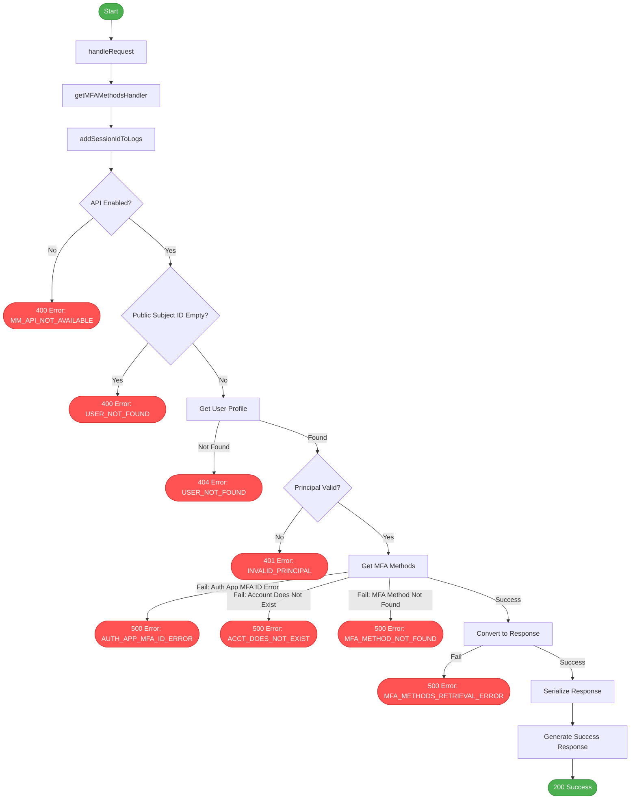

# MFA Method Retrieve Flow

This diagram illustrates the flow of the `MFAMethodsRetrieveHandler` class, showing the different paths through the code and which audit events are emitted along each path.

## Audit Events by User Journey

After analyzing the code and integration tests, it appears that the `MFAMethodsRetrieveHandler` class does not emit any audit events. This handler is focused on retrieving MFA methods for a user and does not perform any operations that would require auditing.

### Successful Journeys

#### Retrieving MFA Methods
- No audit events are emitted during the retrieval of MFA methods

### Failed Journeys

#### API Disabled
- No audit events are emitted when the API is disabled

#### User Not Found
- No audit events are emitted when the user is not found

#### Invalid Principal
- No audit events are emitted when the principal is invalid

#### MFA Method Retrieval Failure
- No audit events are emitted when MFA method retrieval fails