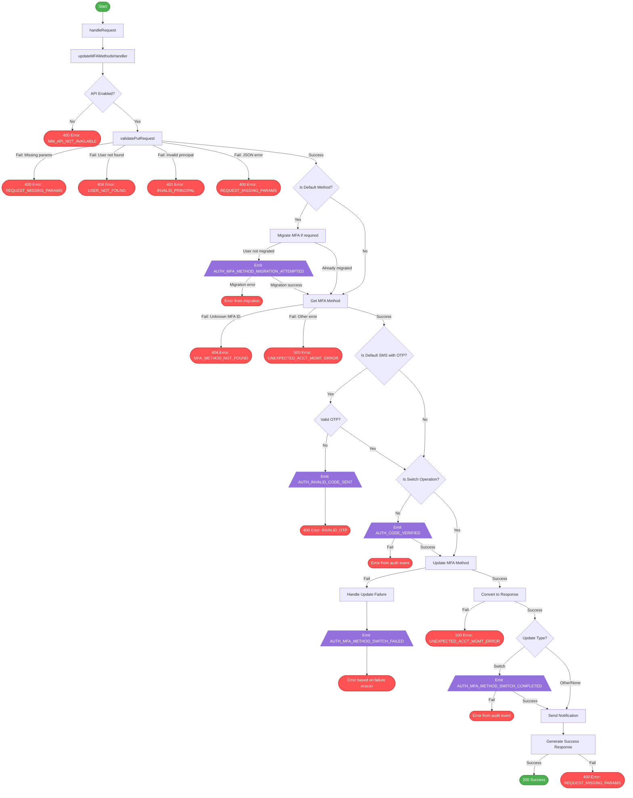

# MFA Method Update Flow

This diagram illustrates the flow of the `MFAMethodsPutHandler` class, showing the different paths through the code and which audit events are emitted along each path.

## Audit Events by User Journey

### Successful Journeys

#### Updating Default Auth App Method
- **AUTH_CODE_VERIFIED**: Emitted after successful validation
  - Includes metadata: ACCOUNT_RECOVERY=false, JOURNEY_TYPE=ACCOUNT_MANAGEMENT
  - Includes metadata: MFA_METHOD=default, MFA_TYPE=AUTH_APP

#### Updating Default SMS Method
- **AUTH_CODE_VERIFIED**: Emitted after successful OTP validation
  - Includes metadata: ACCOUNT_RECOVERY=false, JOURNEY_TYPE=ACCOUNT_MANAGEMENT
  - Includes metadata: MFA_METHOD=default, MFA_TYPE=SMS
  - Includes metadata: MFA_CODE_ENTERED, NOTIFICATION_TYPE=MFA_SMS

#### Switching Backup Method to Default
- **AUTH_MFA_METHOD_SWITCH_COMPLETED**: Emitted after successful method switch
  - Includes metadata: JOURNEY_TYPE=ACCOUNT_MANAGEMENT
  - Includes metadata: MFA_TYPE=(type of new default method)

#### Non-Migrated User Updates Method
- **AUTH_MFA_METHOD_MIGRATION_ATTEMPTED**: Emitted during MFA method migration
  - Includes metadata: HAD_PARTIAL, MFA_TYPE=(SMS or AUTH_APP), JOURNEY_TYPE=ACCOUNT_MANAGEMENT, MIGRATION_SUCCEEDED=true
  - Includes metadata: PHONE_NUMBER_COUNTRY_CODE=(country code) (for SMS methods)
- **AUTH_CODE_VERIFIED**: Emitted after successful validation
  - Includes metadata: ACCOUNT_RECOVERY=false, JOURNEY_TYPE=ACCOUNT_MANAGEMENT
  - Includes metadata: MFA_METHOD=default, MFA_TYPE=(method type)

### Failed Journeys

#### Invalid OTP (SMS Method Only)
- **AUTH_INVALID_CODE_SENT**: Emitted when an invalid OTP code is provided
  - Includes metadata: MFA_METHOD=default, JOURNEY_TYPE=ACCOUNT_MANAGEMENT

#### Method Update Failure
- **AUTH_CODE_VERIFIED**: Emitted after successful validation
  - Includes metadata: ACCOUNT_RECOVERY=false, JOURNEY_TYPE=ACCOUNT_MANAGEMENT
  - Includes metadata: MFA_METHOD=(priority), MFA_TYPE=(method type)
- **AUTH_MFA_METHOD_SWITCH_FAILED**: Emitted when switching methods fails
  - Only emitted for SWITCHED_MFA_METHODS update type with UNEXPECTED_ERROR failure

#### Migration Failure (Non-Migrated User)
- **AUTH_MFA_METHOD_MIGRATION_ATTEMPTED**: Emitted during MFA method migration
  - Includes metadata: HAD_PARTIAL, MFA_TYPE=(SMS or AUTH_APP), JOURNEY_TYPE=ACCOUNT_MANAGEMENT, MIGRATION_SUCCEEDED=false
  - Includes metadata: PHONE_NUMBER_COUNTRY_CODE=(country code) (for SMS methods)