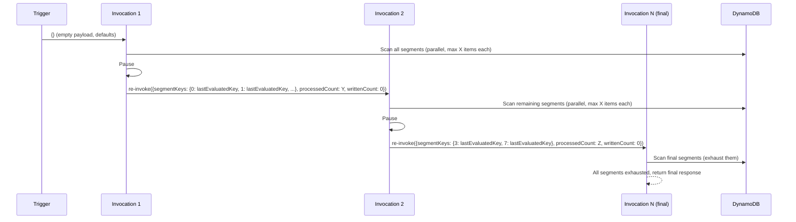
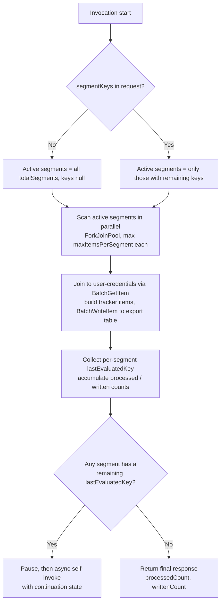

# Inactive account deletion data export

## Summary

A scheduled Lambda (`InactiveAccountDataExportHandler`) scans the full `user-profile`
table, joins each account to its `user-credentials` record, derives a "last active" date
and a resulting "date for deletion", and writes an `InactiveAccountTrackerItem` per account
into an export table.

Because the source tables hold a large number of items in production, a single invocation
cannot complete within the 15-minute Lambda timeout. The handler therefore adopts a "low and
slow" approach: each invocation does a bounded amount of work across all segments, then
re-invokes itself asynchronously with continuation state until every segment is exhausted.

## Context

- This export is a one-time backfill, it exists to seed the Home tracker with data from before
  TxMA audit events existed. Once it has run, the tracker is expected to be maintained from
  audit events alone (including for previously unseen accounts) with later activity updating
  timestamps as those events occur. The Lambda is therefore not intended to run on an ongoing
  schedule.
- The `user-profile` and `user-credentials` tables have large item counts in production
  (>20 million items each).
- The `MFAMethodAnalysisHandler` performs a similar scan and join, but, at the time of writing,
  achieves this with a single-invocation parallel segmented scan, scanning all DynamoDB segments
  to completion in one invocation. This puts sustained high load on DynamoDB, and with the
  current item counts would exceed the Lambda execution time limit.
- We need to spread the scan across time and across invocations to stay within the timeout and
  to avoid overwhelming DynamoDB, while still producing a complete export.

## Decision

### Scan and join

The handler follows the "low and slow" self re-invocation pattern already established by
`BulkUserEmailAudienceLoaderScheduledEventHandler`: each invocation does a bounded amount of
work and, if there is more to do, pauses and re-invokes itself asynchronously to continue,
rather than trying to process everything in one long-running invocation. Here that pattern is
adapted from a single sequential scan to a parallel segmented scan.

Each invocation runs a parallel segmented scan over `user-profile` using a `ForkJoinPool`
of `parallelism` threads across `totalSegments` segments. Scanning by segment distributes load
evenly across partitions rather than concentrating it.

For each page of profiles, the handler batches `BatchGetItem` lookups (max 100 keys) against
`user-credentials` to join by email, retrying unprocessed keys with exponential backoff up to
`maxRetries`. From the joined data it builds an `InactiveAccountTrackerItem`
(see `InactiveAccountDataExportHelper.buildTrackerItem`):

- Last active date is the most recent of the available profile/credential timestamps
  (`UserProfile.Created/Updated`, `termsAndConditions.timestamp`,
  `UserCredentials.Created/Updated`), recording which source it came from.
- Date for deletion is the last active date + 5 years.
- Has setup MFA (`hasSetupMfa`) records whether the account has an MFA method configured
  (see `InactiveAccountDataExportHelper.determineHasSetupMfa`). For accounts migrated to the new
  MFA method model (`UserProfile.mfaMethodsMigrated == true`) this is driven purely by whether
  the `UserCredentials.MfaMethods` list is present and non-empty. For not-yet-migrated accounts
  it is true if the profile has a verified phone number (`PhoneNumberVerified == 1`, i.e. SMS
  MFA) or, failing that, if `UserCredentials.MfaMethods` is present (i.e. TOTP MFA). The logic
  operates directly on the raw DynamoDB `AttributeValue` maps rather than deserialised entities,
  because the scan uses projection expressions to fetch only the required attributes and
  minimise read capacity and network transfer over the large number of scanned items.

Tracker items are buffered and flushed to the export table via `BatchWriteItem` in batches of
25 (the API limit) by `InactiveAccountDataExportBatchWriteService`. Each segment uses its own
buffer/service instance and flushes any partial batch when the segment stops.

As with the `BatchGetItem` read join, `BatchWriteItem` can return unprocessed items: individual
writes that DynamoDB declined, typically because of table throttling or an internal failure.
Crucially these come back in an otherwise successful (HTTP 200) response via the
`UnprocessedItems` field, not as an exception - so the SDK's built-in retry policy, which only
covers request-level errors, does not resubmit them. The caller has to retry them explicitly.
The service therefore loops, resubmitting the unprocessed items with
exponential backoff (reusing the shared `backoff` helper) up to `batchWriteMaxRetries`. Items
still unprocessed once the retries are exhausted are counted as failed and logged rather than
aborting the run, so one hot partition or transient throttle does not fail the whole export.

### Export table ownership

In `staging`, `integration` and `production` the export table
(`inactive_account_tracker_store`) is owned by the Home team; this Lambda writes to it
cross-account (via a dedicated IAM policy granting `BatchWriteItem` plus the relevant KMS
access).

In the dev/authdev environments and the build environment, we own and create a stub
table (`${Env}-stub-inactive-account-tracker`, with its own KMS key) purely so the export can
be conducted end-to-end.

The target table name is supplied per environment via `INACTIVE_ACCOUNT_EXPORT_TABLE_NAME`.

### Bounding work per invocation

Building on the pattern introduced above, each invocation bounds its work by limiting every
segment to `maxItemsPerSegment` items. Once that limit is reached (or a segment is exhausted),
the invocation:

- Carries forward only unfinished segments: Segments with a remaining `lastEvaluatedKey`
  are retained, while fully-exhausted segments drop out of subsequent invocations.
- Pauses (`pauseBetweenInvocationsMs`) then re-invokes itself asynchronously with the
  continuation state (per-segment `lastEvaluatedKey` and accumulated `processedCount` /
  `writtenCount`).
- Returns the completed response once all segments are exhausted, without a further
  re-invocation.

The continuation state is the request/response contract itself: the first invocation is
triggered with an empty payload `{}` (defaulting to all segments and zero counts), and each
re-invocation passes an `InactiveAccountDataExportRequest` carrying `segmentKeys`,
`processedCount` and `writtenCount`.

### Per-invocation flow

### Safeguards

Because this is a one-time run and the chain of self re-invocations is otherwise open-ended,
two safeguards bound it:

1. Maximum invocation count: the Lambda caps how many times the chain may re-invoke itself. The
   cap is derived by estimating the number of invocations the full export should take (from the
   table size, `totalSegments` and `maxItemsPerSegment`) and adding a ~20% buffer, so a runaway
   chain stops rather than looping indefinitely.
2. Manual kill switch: the run is monitored, and if a problem is observed the self-invocation
   can be halted by setting `INACTIVE_ACCOUNT_EXPORT_LAMBDA_NAME` to an invalid value. The
   in-flight invocation then fails at the self-invoke step, so no further invocation is
   triggered.

### Configuration

Behaviour is driven by environment variables (defaults shown), read via
`ConfigurationService`:

| Setting                                   | Env var                                                | Default    |
| ----------------------------------------- | ------------------------------------------------------ | ---------- |
| Scan parallelism (thread pool size)       | `INACTIVE_ACCOUNT_EXPORT_PARALLELISM`                  | `200`      |
| Total scan segments                       | `INACTIVE_ACCOUNT_EXPORT_TOTAL_SEGMENTS`               | `200`      |
| Items scanned per segment per invocation  | `INACTIVE_ACCOUNT_EXPORT_MAX_ITEMS_PER_SEGMENT`        | `7500`     |
| `BatchGetItem` unprocessed-key retries    | `INACTIVE_ACCOUNT_EXPORT_MAX_RETRIES`                  | `3`        |
| `BatchWriteItem` unprocessed-item retries | `INACTIVE_ACCOUNT_EXPORT_BATCH_WRITE_MAX_RETRIES`      | `3`        |
| Pause before re-invocation (ms)           | `INACTIVE_ACCOUNT_EXPORT_PAUSE_BETWEEN_INVOCATIONS_MS` | `60000`    |
| Self-invocation target Lambda name        | `INACTIVE_ACCOUNT_EXPORT_LAMBDA_NAME`                  | (required) |
| Export table name                         | `INACTIVE_ACCOUNT_EXPORT_TABLE_NAME`                   | (required) |

## Consequences

- The export currently runs as a chain of bounded invocations rather than one long-running
  scan, keeping each invocation well within the 15-minute timeout regardless of table size.
- The pause between invocations plus the per-segment item cap keeps DynamoDB read load "low and
  slow", reducing the risk of throttling other consumers of the source tables.
- The run is resumable in principle: continuation state fully describes remaining work. However,
  each invocation depends on successfully triggering the next; a failed async self-invoke stops
  the chain (it throws, and is logged), so the export is not self-healing without a fresh trigger.
- `writtenCount` accumulates across invocations; `maxItemsPerSegment` must be `> 0` or the
  handler fails fast on start.
- Export writes are resilient but not guaranteed: unprocessed `BatchWriteItem` items are retried
  with backoff up to `batchWriteMaxRetries`, after which they are counted (`totalFailed`) and
  logged rather than aborting the run. Failed items are not re-queued for a later invocation, so
  a non-zero failed count means those accounts are absent from the export and monitoring should
  flag it for a re-run.
- Some accounts are skipped by design: `buildTrackerItem` produces no item (logging a
  `Skipping tracker item for public subject ID ...` warning) when it cannot determine a last
  active date - i.e. none of the candidate timestamps (`UserProfile.Created/Updated`,
  `termsAndConditions.timestamp`, `UserCredentials.Created/Updated`) are present or parseable, so
  no `dateForDeletion` can be derived. The Home team expect every account to be replicated, so
  these warnings must be monitored during the runs in higher environments to know if, and why,
  any accounts do not make it across.
