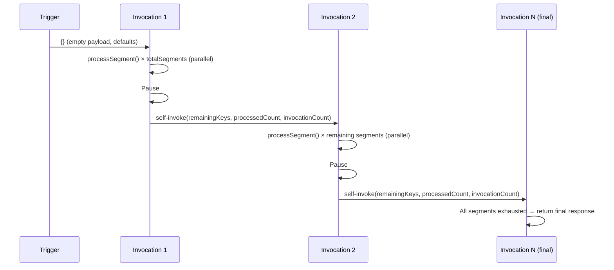

# Chained parallel scan abstraction

## Summary

The "low and slow" chained self-invocation parallel scan pattern, introduced by `InactiveAccountDataExportHandler` (see [ADR 0006](0006-inactive-account-deletion-data-export.md)), has been extracted into a reusable abstract base class, `ChainedParallelScanHandler<TRequest, TResponse>`, alongside a `ChainedParallelScanHelper` utility. Concrete handlers now extend the base class and supply only their domain-specific logic (how to process each segment, how to build continuation requests, and configuration values), while the orchestration (parallel segment dispatch, continuation-state bookkeeping, self-invocation, and safeguards) lives in one place.

## Context

- The inactive account data export handler already implements the full pattern: parallel segmented DynamoDB scan, per-segment item cap, ForkJoinPool management, serialisation of `lastEvaluatedKey` continuation state, async self-invocation with pause, and a maximum invocation safeguard.
- Other upcoming Lambdas (e.g. bulk data operations, further export or migration tasks) will need the same scan-and-chain orchestration over large DynamoDB tables. Without a shared abstraction, each would duplicate the non-trivial control flow, introducing drift and repeated testing effort.
- The pattern has subtle correctness concerns (graceful vs forced pool shutdown, correct key serialisation round-tripping, invocation count tracking) that are better tested once in a shared class than re-verified in every consumer.

## Decision

### `ChainedParallelScanHandler<TRequest, TResponse>`

An abstract generic class in `uk.gov.di.authentication.utils.lambda` that implements `RequestStreamHandler` and owns the full invocation lifecycle. The typed `handleRequest(TRequest request)` method is `public final`: subclasses cannot override the orchestration, only plug in their configuration, request/response mapping, and per-segment work via abstract methods and optional hooks. The stream-level `handleRequest(InputStream, OutputStream, Context)` delegates to it after deserialising the request.

#### Why `RequestStreamHandler` rather than `RequestHandler<TRequest, TResponse>`

The base class deliberately implements the raw-stream `RequestStreamHandler` interface and performs its own (de)serialisation via `SerializationService`, rather than delegating to the Lambda runtime's default POJO (de)serialiser through `RequestHandler<TRequest, TResponse>`.

The self-invocation chain serialises each continuation payload with `SerializationService.writeValueAsString(...)` (which uses `LOWER_CASE_WITH_UNDERSCORES` field naming) and dispatches it as a raw JSON string through `LambdaInvokerService.invokeAsyncWithPayload(...)`. The inbound side deserialises using the same `SerializationService`, so the field-naming policy is symmetric and payloads round-trip cleanly. If the inbound side relied on the Lambda runtime's default POJO deserialiser instead, the runtime's field-naming conventions could diverge from `SerializationService`'s underscore policy, causing self-invoked payloads to fail to deserialise. By reading the raw `InputStream` and writing the raw `OutputStream` with the same `SerializationService`, both sides are guaranteed to stay in sync.

Because the runtime no longer supplies a typed request object, subclasses provide the concrete request type via `getRequestClass()`, which the base class uses to deserialise the incoming stream into `TRequest`.

The base class requires subclasses to implement:

- Request type: `getRequestClass()`, used to deserialise the incoming stream into the concrete `TRequest`.
- Configuration methods: `getMaxInvocations()`, `getParallelism()`, `getTotalSegments()`, `getMaxItemsPerSegment()`, `getPauseBetweenInvocationsMs()`, `getLambdaName()`.
- Request/response mapping: `getSegmentKeysFromRequest(request)`, `getProcessedCountFromRequest(request)`, `getInvocationCountFromRequest(request)`, `buildContinuationRequest(remainingKeys, processedCount, invocationCount)`, `buildResponse(processedCount)`.
- Segment processing: `processSegment(segment, totalSegments, maxItemsPerSegment, exclusiveStartKey)`, which contains the domain-specific work for each DynamoDB segment.

It also provides overridable lifecycle hooks: `beforeScan(request)`, `onMaxInvocationsExceeded(...)`, `onInvocationComplete(...)`, and `buildEarlyExitResponse(request)`.

The handler accepts a `LambdaInvokerService` through its constructor and uses it to perform the async self-invocation. Continuation payloads are serialised via `SerializationService`.

#### Segment result contract

Each call to `processSegment` returns a `SegmentResult(long itemsScanned, Map<String, AttributeValue> lastEvaluatedKey)`. The base class uses `itemsScanned` to accumulate the processed count and `lastEvaluatedKey` to decide which segments need further work. Domain-specific counters (e.g. `writtenCount`, `missingCredentialsCount`) are tracked by the subclass itself; the base class deliberately does not prescribe them.

The base class also exposes a `public record SegmentTask(int segment, ForkJoinTask<SegmentResult> task)` which pairs a segment index with its in-flight `ForkJoinTask`. This is used internally to collect results after the pool shuts down and is `public` to allow subclasses or tests to inspect it if needed.

#### Invocation flow

The invocation flow is unchanged from ADR 0006, but now lives in the base class:

### `ChainedParallelScanHelper`

A stateless utility class in `uk.gov.di.authentication.utils.helpers` containing:

- `toDynamoKeys` / `toSerialisableKeys`: round-trip conversion between the DynamoDB `AttributeValue` maps used at scan time and the `Map<String, String>` form that serialises cleanly into JSON continuation payloads.
- `gracefulPoolShutdown`: orderly shutdown with a 15-minute await, logging a warning on timeout and restoring the interrupt flag if interrupted.
- `forcePoolShutdown`: idempotent `shutdownNow`, used in the `finally` block to guarantee cleanup.

These were previously private methods in `InactiveAccountDataExportHandler`.

### Refactoring of `InactiveAccountDataExportHandler`

The existing handler now extends `ChainedParallelScanHandler<InactiveAccountDataExportRequest, InactiveAccountDataExportResponse>` and implements only:

- Configuration getters, delegating to the same `ConfigurationService`-backed fields.
- Request/response mapping, extracting `segmentKeys`, `processedCount`, `invocationCount` from `InactiveAccountDataExportRequest` and constructing continuation/response objects.
- `processSegment`, which calls the existing `scanSegment` method (still containing the domain-specific scan, join, tracker-item build, and batch-write logic) and maps its richer `ScanSegmentResult` to the base class's `SegmentResult`, accumulating `writtenCount` and `missingCredentialsCount` via `AtomicLong` counters.
- Lifecycle hooks: `beforeScan` initialises per-invocation counters, `onInvocationComplete` logs the domain-specific metrics, and `onMaxInvocationsExceeded` and `buildEarlyExitResponse` include the written count in their output.

The handler tracks three `AtomicLong` counters:

- `invocationWrittenCount` — items written to the export table in the current invocation.
- `invocationMissingCredentialsCount` — user-profile items for which no credentials record was found in the current invocation.
- `runningWrittenCount` — cumulative written count across all invocations, carried forward in the continuation payload via `buildContinuationRequest` and restored in `beforeScan`.

The handler's `scanSegment` method and all downstream helpers (`InactiveAccountDataExportHelper`, `InactiveAccountDataExportBatchWriteService`) are unchanged. The internal record was renamed from `SegmentResult` to `ScanSegmentResult` to avoid clashing with the base class's `SegmentResult`.

### Testing

- `ChainedParallelScanHelperTest`: unit tests for key serialisation round-tripping, null/empty handling, and both pool shutdown paths.
- `ChainedParallelScanHandlerTest`: tests the base class orchestration via a `StubHandler` that extends `ChainedParallelScanHandler` with in-memory stub types. Covers: validation (`maxItemsPerSegment <= 0`), max-invocations guard, first-invocation defaults from null request, processed-count accumulation, self-invocation trigger and payload content, no self-invocation when all segments are exhausted, error paths (missing lambda name, failed invoke), and correct segment filtering on continuation.

## Consequences

- New chained parallel scan Lambdas can be built by extending `ChainedParallelScanHandler` and implementing the abstract methods. The orchestration, self-invocation, safeguards, and pool lifecycle are inherited and do not need to be re-implemented or re-tested.
- The `InactiveAccountDataExportHandler` is simplified: its `handleRequest` is removed entirely, and the control-flow concerns (segment dispatch, continuation, pool management) are no longer its responsibility. Domain-specific counters (`writtenCount`, `missingCredentialsCount`) are now tracked via `AtomicLong` fields rather than local variables, reflecting that `processSegment` is called from parallel threads. This was already the case before, but is now more explicit.
- Because `handleRequest` is `final`, subclasses cannot accidentally bypass the safeguards (max invocations check, pool cleanup). If a subclass needs to opt out of a safeguard, it must do so through the provided hooks (e.g. overriding `onMaxInvocationsExceeded`).
- The `SegmentResult` contract is intentionally minimal (items scanned + last evaluated key). Domain-specific metrics must be tracked by the subclass. This keeps the base class generic but means each subclass is responsible for its own counter thread-safety.
- The key serialisation helpers assume all DynamoDB key attributes are strings (`AttributeValue.s()`). This holds for the current tables (which use string partition keys), but a future table with a numeric or binary key would need the helpers extended.
