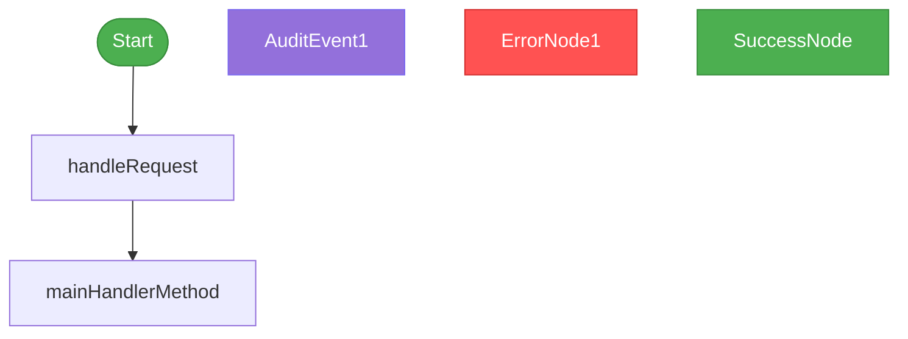

# Rules for Handler Flow Diagrams and Audit Event Documentation

## Purpose

This document defines the standard approach for creating flow diagrams that document handler classes and their audit events. Following these rules ensures consistency and completeness in documenting the behavior of handlers across the codebase.

## When to Create Flow Diagrams

Create a flow diagram for any handler class that:
- Emits audit events
- Has multiple execution paths
- Handles user requests with different outcomes

## File Structure and Location

1. Create a markdown file named `[handler_name]_flow.md`
2. Store the file in the appropriate module's `docs/diagrams/` directory
3. Reference the diagram in the module's main documentation

## Diagram Content Requirements

Each flow diagram document must include:

1. **Title and Description**: Brief explanation of the handler's purpose
2. **Mermaid Flow Diagram**: Visual representation of all execution paths
3. **Audit Events by User Journey**: Documentation of audit events emitted in each scenario

## Mermaid Flow Diagram Standards

### Node Types and Styling

- **Start Node**: Green rounded rectangle `([Start])`
  ```
  style Start fill:#4CAF50,stroke:#388E3C,color:white
  ```

- **Process Nodes**: Default rectangles `[Process Step]`

- **Decision Points**: Diamond shapes `{Decision?}`

- **Audit Event Nodes**: Purple parallelograms `[/Emit EVENT_NAME\]`
  ```
  style AuditEventNode fill:#9370DB,stroke:#7B68EE,color:white
  ```

- **Error Nodes**: Red rounded rectangles `([Error])`
  ```
  style ErrorNode fill:#FF5252,stroke:#D32F2F,color:white
  ```

- **Success Node**: Green rounded rectangle `([Success])`
  ```
  style SuccessNode fill:#4CAF50,stroke:#388E3C,color:white
  ```

### Connection Standards

- Label all connections with clear descriptions
- Use `-->|Label|` syntax for labeled connections
- Show all possible paths through the code

## Audit Events Documentation Standards

### Organization

1. Group audit events by user journey type:
   - Successful journeys
   - Failed journeys

2. For each journey type, document:
   - Specific scenarios (e.g., "Non-Migrated User Adds SMS Method")
   - Sequence of audit events emitted
   - Metadata included with each event

### Event Documentation Format

For each audit event:
1. **Bold the event name**: `**EVENT_NAME**`
2. Describe when it's emitted
3. List metadata included with the event
4. Note any sensitive data included (e.g., phone numbers)

Example:
```
- **AUTH_CODE_VERIFIED**: Emitted after successful OTP validation
  - Includes metadata: MFA_CODE_ENTERED, NOTIFICATION_TYPE=MFA_SMS
  - Includes phone number in audit context
```

## Verification Requirements

Before submitting a flow diagram:

1. **Code Review**: Verify all execution paths against the handler code
2. **Integration Test Check**: Confirm audit events match integration test assertions
3. **Completeness Check**: Ensure all possible paths and outcomes are documented
4. **Metadata Accuracy**: Verify metadata fields match what's in the code

## Example Template

```markdown
# [Handler Name] Flow

This diagram illustrates the flow of the `[HandlerClassName]` class, showing the different paths through the code and which audit events are emitted along each path.



## Audit Events by User Journey

### Successful Journeys

#### [Journey Type 1]
- **[AUDIT_EVENT_1]**: [When it's emitted]
  - Includes metadata: [List key metadata]
- **[AUDIT_EVENT_2]**: [When it's emitted]
  - Includes metadata: [List key metadata]

### Failed Journeys

#### [Failure Scenario 1]
- **[AUDIT_EVENT_3]**: [When it's emitted]
  - Includes metadata: [List key metadata]
```